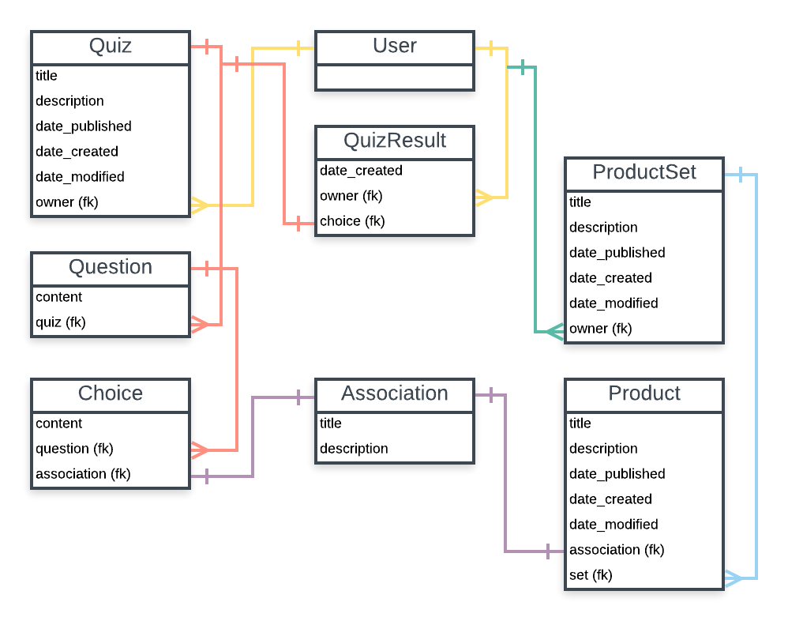

Basic scaffold for a quiz that gives recommendations using Django, Django Rest Framework and React.

The initial inspiration was that I wanted a quiz to tell me what kind of software engineer I should be (frontend, backend, fullstack, data, ux, etc.), and I also wanted to build something other than a blog with Django (which I'm also building). In the end, I decided it should be more generic, so it's a quiz for anything.

**The default admin superuser account is:**

username: admin

password: admin

email: admin@admin.com

Here's a data model diagram:

